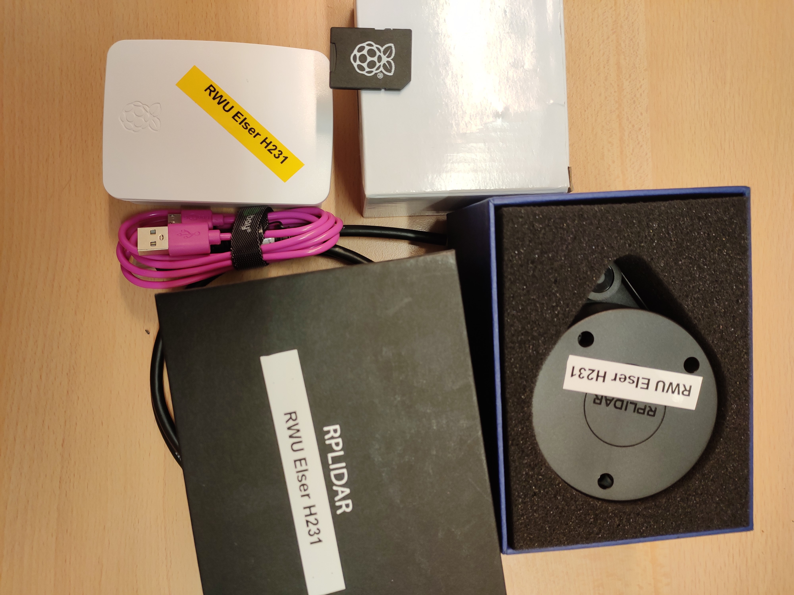
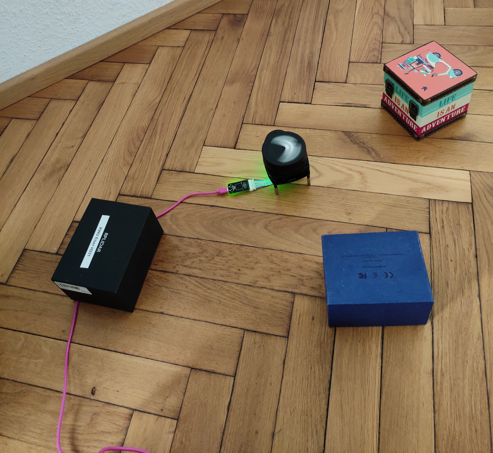
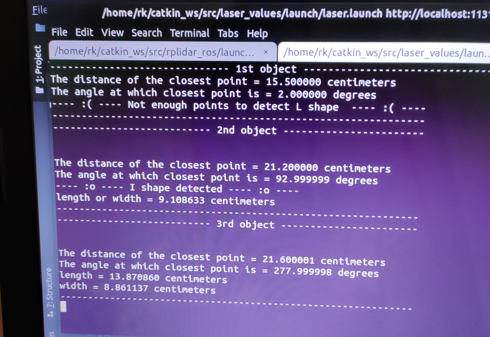

# Object-detection-using-RP-LIDAR
This project aims at the LIDAR sensor to detect the obstacles using point cloud data with Raspberry Pi 3B

__Components used:__
1. RPLIDAR
2. Raspberry Pi 3B 

__Setup:__

__Result:__

